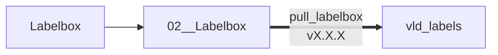
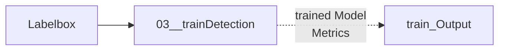

# VLD Uniformity
This project is design in order to get an information about tirebuilding product position in order to find correlation with uniformity results.

There are 3 products to detects :
- BT : Detect BT Edge and trusquin
- BJ : Detect CC Edge and BJ Trusquin
- TRI : Detect TRI in the image

# Pipelines structure
Data Gathering :
```mermaid
flowchart LR;
    vld_data-..->01__TrainSSL;
    01__TrainSSL-.Generates.->trainSSL_Output;
    trainSSL_Output-.Clusters.->02__Labelbox;
    vld_data-.Date Filter.->02__Labelbox
    02__Labelbox-.feed_labelbox_SSL.py\nfeed_labelbox_Date.py.-> Labelbox
```

Model Training :


Model Assisted Labelling / ModelRun :
```mermaid
flowchart LR;
    train_Output --> 05__MAL;
    05__MAL -. mal_BT.py\nvX.X.X .-> vld-labels/MAL;
```
```mermaid
flowchart LR;
    vld-labels/MAL --> 02__Labelbox;
    02__Labelbox -. feed_labelbox_MAL.py .-> Labelbox;
```
```mermaid
flowchart LR;
    train_Output --> 07__ModelRun;
    07__ModelRun -. MRun_BT.py .-> Labelbox;
```

## BT Image processing
In order to train BT model we have different dataset version.

|Dataset Version|Dataset Content             |
|---------------|----------------------------|
|v0.0.1         | Init. Batch of 225 images  |
|v0.0.2         | Add 77 BT images from VLD  |